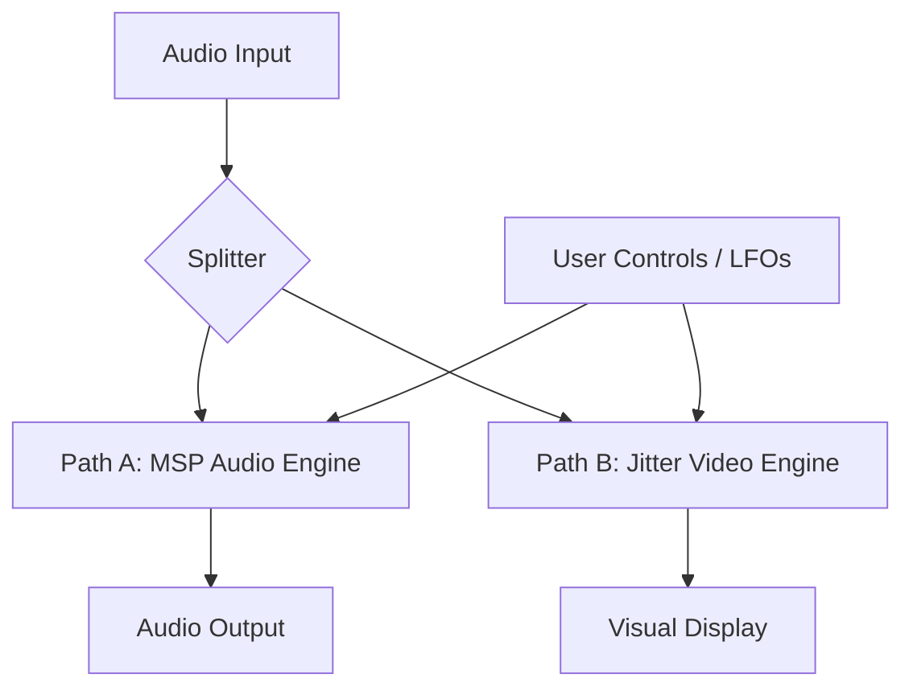

# System Architecture: Teevee v7 (Twin Engine / Parallel)

## I. Core Concept

**Teevee v7** abandons the "Audio-inside-Video" architecture (v6) in favor of a **Parallel Twin Engine**.

We no longer process audio inside Jitter matrices. Instead, we run two simultaneous processing chains driven by a unified control system.

  * **The Audio Engine (MSP):** High-fidelity, 64-bit, artifact-free DSP.
  * **The Video Engine (Jitter):** A reactive "Heads-Up Display" that visualizes the audio manipulations using metaphorical shaders.

**The Goal:** "What you see is what you hear," but without the digital degradation of video-to-audio conversion.

-----

## II. System Topology

The system is split into three distinct domains:

1.  **Sync Core (Control Voltage):** A central clock/LFO system that drives parameters.
2.  **Path A: Hi-Def Audio (The Truth):** Standard MSP buffers and spectral processors.
3.  **Path B: Visualizer (The Metaphor):** GPU shaders acting as a "Slit-Scan" interpretation of the audio state.

<!-- end list -->



-----

## III. The Synesthetic Map (The Link)

This map defines how visual transformations translate to audio DSP. We use **Mechanic Isomorphism** (processes that *feel* the same).

| Parameter | Visual Metaphor (GPU) | Audio Mechanism (MSP) | The Shared Experience |
| :--- | :--- | :--- | :--- |
| **SCROLL** | **Vertical Pan** (Y-Axis Offset) | **Delay Line** (Time Offset) | Pushing the content away into the "past." |
| **ZOOM** | **UV Scaling** (Stretch/Squash) | **Varispeed / Pitch** (Repitch) | Stretching the medium. Zoom In = Slow Down (Low Pitch). Zoom Out = Speed Up (High Pitch). |
| **ROTATE** | **2D Rotation** (Twist) | **Frequency Shift** (Spectrum Shift) | Displacing the content from its center. Rotating pixels = Shifting Hertz. |
| **SMEAR** | **Frame Feedback** (Blur) | **Reverb / Feedback** (Decay) | The refusal of the signal to die. Trails in space = Trails in time. |
| **FREEZE** | **Pixel Sorting / Bloom** | **Buffer Loop** (Gating) | Time stops. The current moment is trapped and degrades into entropy. |

-----

## IV. Path A: The Hi-Def Audio Engine (MSP)

This engine prioritizes bit-transparency and standard DAW behavior.

### 1. The Container

  * **Object:** `buffer~ tv_audio_ring 65536 2` (Stereo, \~1.5s history).
  * **Ingest:** `poke~ tv_audio_ring` writes audio circularly.

### 2. The Playback Head (Scroll & Zoom)

Instead of `jit.peek~`, we use `groove~` or `index~` logic.

  * **Zoom Logic:** The `groove~` playback speed is linked to the Zoom knob.
      * Zoom 1.0 = Speed 1.0.
      * Zoom 0.5 (In) = Speed 0.5 (Octave Down).
  * **Scroll Logic:** A delay offset applied to the read pointer.
      * `tapin~` / `tapout~` is arguably cleaner for pure delay, but `phasor~` reading the buffer allows for "Scrubbing."
      * *Implementation:* `phasor~` (Master Sync) + `offset` $\to$ `index~ tv_audio_ring`.

### 3. The Twister (Rotate)

  * **Object:** `freqshift~` (Bode Shifter).
  * **Logic:**
      * Visual Rotate Right (+90°) $\to$ Shift Up (+500Hz).
      * Visual Rotate Left (-90°) $\to$ Shift Down (-500Hz).
      * *Note:* Use a dry/wet mix. Frequency shifting is destructive and inharmonic.

### 4. The Wash (Smear)

  * **Object:** A simple Feedback Delay Network (FDN) or `cverb~`.
  * **Logic:**
      * Visual Smear 0% = Dry Audio.
      * Visual Smear 100% = Infinite Reverb Tail (Freeze).

-----

## V. Path B: The Video Engine (Jitter)

This engine prioritizes aesthetics and frame rate. It does **not** affect the sound.

### 1. The Ingest (Analysis)

We do not write raw audio to the texture (it looks like static). We write **Features**.

  * **Objects:** `jit.poke~` into `jit.matrix tv_viz_ram 4 float32 256 256`.
  * **The MS-Flux Mapping (Restored from v2.5):**
      * **Plane 0 (Alpha):** Audio Amplitude (RMS).
      * **Plane 1 (Red):** Mono Signal (Waveform).
      * **Plane 2 (Green):** Spectral Flux (High-frequency content).
      * **Plane 3 (Blue):** Stereo Width (Side channel).

### 2. The Shader (`jit.gl.pix`)

The shader performs the "Unsafe" transforms that we removed from v6.

```glsl
// Concept Code for tv.core.genjit
in vec2 uv;
uniform float zoom; // Linked to Audio Pitch
uniform float rotate; // Linked to Freq Shift
uniform float scroll; // Linked to Delay Time
uniform sampler2D tex_input;

void main() {
    vec2 st = uv;

    // 1. ROTATE (Matches Freq Shift)
    // Standard 2D rotation matrix around center (0.5, 0.5)

    // 2. ZOOM (Matches Pitch)
    // Scale coordinates from center

    // 3. SCROLL (Matches Delay)
    // Offset Y axis: st.y += scroll;

    out = sample(tex_input, st);
}
```

-----

## VI. Interaction & Control Logic

### 1. The Freeze (Datamosh Break)

  * **Trigger:** User toggle.
  * **Audio Action:**
      * `gate~ 0` cuts the input to `poke~` (Buffer stops recording).
      * The Read Head (`index~`) keeps looping the existing buffer.
  * **Video Action:**
      * Stop `jit.poke~` (Matrix stops updating).
      * Enable "Bloom" or "Pixel Sort" shader pass to degrade the static image.

### 2. The Scrubber (Tape Slip)

  * **Trigger:** Random LFO.
  * **Audio Action:** Adds jittery noise to the `index~` read pointer. Creates pitch warble/flutter.
  * **Video Action:** Adds `noise` to the Shader `st.x` coordinate. Creates "tracking error" horizontal displacement.

-----

## VII. Advantages of v7 Architecture

1. **Audio Quality:** 100% MSP 64-bit float. No interpolation noise from video processing.
2. **Safety:** GPU crashes do not kill the audio stream.
3. **Flexibility:** Visual effects can be exaggerated without destroying audio.
4. **M4L Stability:** Removes the complex "matrix-to-signal" dependency.
5. **CPU Efficiency:** Standard MSP objects are more efficient than jit.peek~/poke~ round-trips.

-----

## VIII. Module Reference

### Directory Structure

```text
Teevee_Project/
├── teevee.amxd             (The Shell: Host device, parameters, and routing)
├── modules/
│   ├── tv.main.maxpat      (The Router: Connects both engines)
│   ├── tv.audio.maxpat     (PATH A: MSP audio engine)
│   ├── tv.sync.maxpat      (The Clock: Master timing)
│   ├── tv.ingest.maxpat    (PATH B: Audio features → Viz matrix)
│   ├── tv.viz.maxpat       (PATH B: Display)
│   ├── tv.param.maxpat     (The Hub: Dual-path parameter distribution)
│   └── tv.egress.maxpat    (DEPRECATED - kept for reference)
└── code/
    ├── tv.encode.gendsp    (Viz only: L/R → features for display)
    └── tv.core.genjit      (Video Gen: Scroll, Warp, Smear, Edge)
```

### Module Descriptions

| Module | Purpose |
|:-------|:--------|
| **tv.main.maxpat** | Routes audio through Path A (tv.audio → plugout~) and visual through Path B (tv.ingest → tv.viz) |
| **tv.audio.maxpat** | Hi-Def Audio Engine - pure MSP processing with delay, varispeed, freqshift, reverb |
| **tv.sync.maxpat** | Master clock/index generation for both paths |
| **tv.ingest.maxpat** | Writes audio features to visualization-only matrix (---tv_viz_ram) |
| **tv.viz.maxpat** | Display rendering |
| **tv.param.maxpat** | Dual-path parameter distribution hub - routes controls to both engines |
| **tv.egress.maxpat** | DEPRECATED - Old v6 matrix-to-audio reader, kept for reference only |

-----

## IX. Parameter Reference (v7.1)

### Input Parameter Ranges (UI Dials: 0-1)

All parameters arrive at `tv.param.maxpat` as normalized 0-1 values from the UI.

### Audio Engine Scaling (tv.audio.maxpat)

| Parameter | Input | Scaled Output | MSP Object | Notes |
|:----------|:------|:--------------|:-----------|:------|
| **Scroll** | 0-1 | 0-1000 ms | `scale~ 0. 1000. 0 44100` → delay offset | Maps to ~1 second max delay |
| **Zoom** | 0-1 | 0.5-2.0× speed | `*~ 86.` → `phasor~` | 0.5 = octave down, 2.0 = octave up |
| **Rotate** | 0-1 | -500 to +500 Hz | `freqshift~` | Bode frequency shifter |
| **Smear** | 0-1 | 0-1 wet/dry | `*~` crossfade | 0 = dry, 1 = full reverb |
| **Freeze** | 0/1 | 0/1 gate | `*~` gates input | Stops buffer writing when frozen |

### Visual Engine Scaling (tv.core.genjit)

| Parameter | Input | Scaled Output | Shader Param | Notes |
|:----------|:------|:--------------|:-------------|:------|
| **Scroll** | 0-1 | 0-1 | `scroll_speed` | Y-axis pan velocity |
| **Zoom** | 0-1 | 0.5-2.0 | `zoom` | UV scaling (0.25-4.0 supported) |
| **Rotate** | 0-1 | -π to +π rad | `rotation` | 2D rotation in radians |
| **Smear** | 0-1 | 0-0.95 | `smear` | Frame feedback (capped to prevent infinite) |
| **Edge** | 0-1 | 0-1 | `edge_amount` | Sobel edge detection mix |
| **Warp X/Y** | 0-1 | -1 to +1 | `warp_x`, `warp_y` | Barrel/pincushion distortion |

### Freeze Behavior

**Audio (tv.audio.maxpat):**
- Freeze = 1: Input signal is gated (`*~ 0`), buffer stops recording
- Delay buffer continues looping existing content
- All other processing (zoom, rotate, smear) still applies

**Visual (tv.core.genjit):**
- Freeze stops matrix updates in tv.ingest
- Existing frame continues to be processed with feedback effects

-----

## Appendix I. M4L Object Compatibility (IMPORTANT)

### Objects NOT Available in M4L
These objects caused "No such object" errors:
- `gigaverb~` - Use tapin~/tapout~ instead
- `freeverb~` - Use tapin~/tapout~ instead
- `vdelay~` - Use buffer~/poke~/index~ circular buffer instead
- `wrap~` - Use `%~` (modulo) instead
- `yafr2` - Has internal `clip` objects that don't understand signals

### Objects Confirmed Working in M4L
- `buffer~`, `poke~`, `index~` - Circular buffer operations
- `tapin~`, `tapout~` - Fixed delay lines (message-rate delay time)
- `phasor~`, `scale~`, `-~`, `+~`, `*~`, `!-~`, `%~` - Basic DSP math
- `freqshift~` - Bode frequency shifter
- `line~` - Signal interpolation
- `r`, `s` - Receive/send with `---` prefix for M4L scoping

-----

## Appendix II. Current tv.audio.maxpat Architecture

The working audio engine uses a 4-stage serial processing chain:

```
Input L/R
    ↓
┌─────────────────────────────────────────────────────────┐
│ STAGE 1: DELAY (SCROLL)                                 │
│ buffer~ ---tv_delay_l/r → poke~ (write)                 │
│ phasor~ 0.5 → scale~ → write index                      │
│ write_idx - scroll_offset → %~ 88200 → index~ (read)    │
│ Scroll param (0-1000ms) controls delay offset           │
└─────────────────────────────────────────────────────────┘
    ↓
┌─────────────────────────────────────────────────────────┐
│ STAGE 2: VARISPEED (ZOOM)                               │
│ buffer~ ---tv_pitch_l/r → poke~ (write at fixed rate)   │
│ phasor~ 86 → scale~ → write index                       │
│ zoom * 86 → phasor~ → scale~ → index~ (read)            │
│ Zoom param (0.5-2.0) controls playback speed/pitch      │
└─────────────────────────────────────────────────────────┘
    ↓
┌─────────────────────────────────────────────────────────┐
│ STAGE 3: FREQ SHIFT (ROTATE)                            │
│ freqshift~ with shift amount from rotate param          │
│ Rotate param (-500 to +500 Hz) controls shift           │
└─────────────────────────────────────────────────────────┘
    ↓
┌─────────────────────────────────────────────────────────┐
│ STAGE 4: REVERB (SMEAR)                                 │
│ tapin~ 1000 → tapout~ 29 67 / 37 79 → *~ 0.4 (feedback) │
│ Dry/wet crossfade: dry * (1-smear) + wet * smear        │
│ Smear param (0-1) controls wet/dry mix                  │
└─────────────────────────────────────────────────────────┘
    ↓
Output L/R
```

### Parameter Receives
- `r ---tv_audio_scroll` → delay offset (0-1000ms)
- `r ---tv_audio_zoom` → playback speed (0.5-2.0)
- `r ---tv_audio_rotate` → freq shift (-500 to +500 Hz)
- `r ---tv_audio_smear` → reverb wet/dry (0-1)
- `r ---tv_audio_freeze` → (not yet implemented)

-----

## Appendix III. Current tv.fx.maxpat Architecture

The working visualization engine uses a 5-stage processing chain:

```
Bang (frame trigger from tv.sync)
    ↓
┌─────────────────────────────────────────────────────────┐
│ TRIGGER: t b b b b b b                                  │
│ Bangs all parameter stores and matrix reads each frame  │
└─────────────────────────────────────────────────────────┘
    ↓
┌─────────────────────────────────────────────────────────┐
│ PARAM STORAGE (float objects)                           │
│ r ---tv_param_scroll → float → scale 0-1 to -128..128   │
│ r ---tv_param_zoom → float → scale 0-1 to 0.5..2.0      │
│ r ---tv_param_rotation → float → scale 0-1 to -180..180 │
│ r ---tv_param_smear → float (0-0.95 feedback amount)    │
│ Values stored on receive, output on frame bang          │
└─────────────────────────────────────────────────────────┘
    ↓
┌─────────────────────────────────────────────────────────┐
│ STAGE 1: READ 1D MATRIX                                 │
│ jit.matrix ---tv_viz_ram 4 float32 65536                │
│ Reads audio features written by tv.ingest               │
└─────────────────────────────────────────────────────────┘
    ↓
┌─────────────────────────────────────────────────────────┐
│ STAGE 2: RESHAPE TO 2D                                  │
│ jit.matrix 4 float32 256 256 @adapt 0                   │
│ Converts 1D buffer to 2D image for display              │
└─────────────────────────────────────────────────────────┘
    ↓
┌─────────────────────────────────────────────────────────┐
│ STAGE 3: TRANSFORM (jit.rota @boundmode 4)              │
│ offset_y ← scroll (vertical pan)                        │
│ zoom_x, zoom_y ← zoom (UV scaling)                      │
│ theta ← rotation (2D rotation in degrees)               │
└─────────────────────────────────────────────────────────┘
    ↓
┌─────────────────────────────────────────────────────────┐
│ STAGE 4: SMEAR (feedback blend)                         │
│ new_frame * (1 - smear) + prev_frame * smear            │
│ jit.matrix ---tv_viz_ram_out stores previous frame      │
│ jit.op @op * scales each, jit.op @op + combines         │
└─────────────────────────────────────────────────────────┘
    ↓
┌─────────────────────────────────────────────────────────┐
│ STAGE 5: COLORIZE (jit.gen)                             │
│ ARGB planes → RGB display with boost and cross-mod      │
│ Alpha (plane 0): amplitude × 3                          │
│ Red (plane 1): waveform × 5 + green × 0.3               │
│ Green (plane 2): flux × 10 (boosted, small values)      │
│ Blue (plane 3): stereo × 5 + alpha × 0.5                │
└─────────────────────────────────────────────────────────┘
    ↓
Outlet → tv.viz for display
```

### Parameter Receives
- `r ---tv_param_scroll` → offset_y for jit.rota (0-1 → -128..128 pixels)
- `r ---tv_param_zoom` → zoom_x/zoom_y for jit.rota (0-1 → 0.5..2.0)
- `r ---tv_param_rotation` → theta for jit.rota (0-1 → -180..180 degrees)
- `r ---tv_param_smear` → feedback blend amount (0-0.95)
