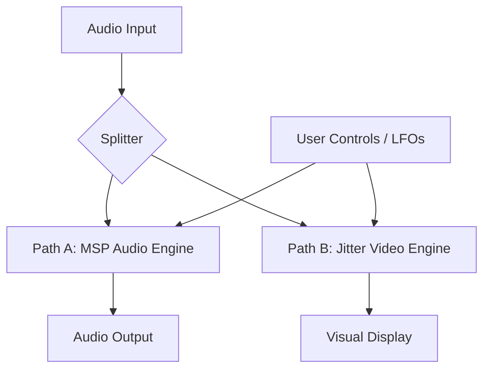

# System Architecture: Teevee v7 (Twin Engine / Parallel)

## I. Core Concept

**Teevee v7** abandons the "Audio-inside-Video" architecture (v6) in favor of a **Parallel Twin Engine**.

We no longer process audio inside Jitter matrices. Instead, we run two simultaneous processing chains driven by a unified control system.

  * **The Audio Engine (MSP):** High-fidelity, 64-bit, artifact-free DSP.
  * **The Video Engine (Jitter):** A reactive "Heads-Up Display" that visualizes the audio manipulations using metaphorical shaders.

**The Goal:** "What you see is what you hear," but without the digital degradation of video-to-audio conversion.

-----

## II. System Topology

The system is split into three distinct domains:

1.  **Sync Core (Control Voltage):** A central clock/LFO system that drives parameters.
2.  **Path A: Hi-Def Audio (The Truth):** Standard MSP buffers and spectral processors.
3.  **Path B: Visualizer (The Metaphor):** GPU shaders acting as a "Slit-Scan" interpretation of the audio state.

<!-- end list -->



-----

## III. The Synesthetic Map (The Link)

This map defines how visual transformations translate to audio DSP. We use **Mechanic Isomorphism** (processes that *feel* the same).

| Parameter | Visual Metaphor (GPU) | Audio Mechanism (MSP) | The Shared Experience |
| :--- | :--- | :--- | :--- |
| **SCROLL** | **Vertical Pan** (Y-Axis Offset) | **Delay Line** (Time Offset) | Pushing the content away into the "past." |
| **ZOOM** | **UV Scaling** (Stretch/Squash) | **Varispeed / Pitch** (Repitch) | Stretching the medium. Zoom In = Slow Down (Low Pitch). Zoom Out = Speed Up (High Pitch). |
| **ROTATE** | **2D Rotation** (Twist) | **Frequency Shift** (Spectrum Shift) | Displacing the content from its center. Rotating pixels = Shifting Hertz. |
| **SMEAR** | **Frame Feedback** (Blur) | **Reverb / Feedback** (Decay) | The refusal of the signal to die. Trails in space = Trails in time. |
| **FREEZE** | **Pixel Sorting / Bloom** | **Buffer Loop** (Gating) | Time stops. The current moment is trapped and degrades into entropy. |

-----

## IV. Path A: The Hi-Def Audio Engine (MSP)

This engine prioritizes bit-transparency and standard DAW behavior.

### 1. The Container

  * **Object:** `buffer~ tv_audio_ring 65536 2` (Stereo, \~1.5s history).
  * **Ingest:** `poke~ tv_audio_ring` writes audio circularly.

### 2. The Playback Head (Scroll & Zoom)

Instead of `jit.peek~`, we use `groove~` or `index~` logic.

  * **Zoom Logic:** The `groove~` playback speed is linked to the Zoom knob.
      * Zoom 1.0 = Speed 1.0.
      * Zoom 0.5 (In) = Speed 0.5 (Octave Down).
  * **Scroll Logic:** A delay offset applied to the read pointer.
      * `tapin~` / `tapout~` is arguably cleaner for pure delay, but `phasor~` reading the buffer allows for "Scrubbing."
      * *Implementation:* `phasor~` (Master Sync) + `offset` $\to$ `index~ tv_audio_ring`.

### 3. The Twister (Rotate)

  * **Object:** `freqshift~` (Bode Shifter).
  * **Logic:**
      * Visual Rotate Right (+90°) $\to$ Shift Up (+500Hz).
      * Visual Rotate Left (-90°) $\to$ Shift Down (-500Hz).
      * *Note:* Use a dry/wet mix. Frequency shifting is destructive and inharmonic.

### 4. The Wash (Smear)

  * **Object:** A simple Feedback Delay Network (FDN) or `cverb~`.
  * **Logic:**
      * Visual Smear 0% = Dry Audio.
      * Visual Smear 100% = Infinite Reverb Tail (Freeze).

-----

## V. Path B: The Video Engine (Jitter)

This engine prioritizes aesthetics and frame rate. It does **not** affect the sound.

### 1. The Ingest (Analysis)

We do not write raw audio to the texture (it looks like static). We write **Features**.

  * **Objects:** `jit.poke~` into `jit.matrix tv_viz_ram 4 float32 256 256`.
  * **The MS-Flux Mapping (Restored from v2.5):**
      * **Plane 0 (Alpha):** Audio Amplitude (RMS).
      * **Plane 1 (Red):** Mono Signal (Waveform).
      * **Plane 2 (Green):** Spectral Flux (High-frequency content).
      * **Plane 3 (Blue):** Stereo Width (Side channel).

### 2. The Shader (`jit.gl.pix`)

The shader performs the "Unsafe" transforms that we removed from v6.

```glsl
// Concept Code for tv.core.genjit
in vec2 uv;
uniform float zoom; // Linked to Audio Pitch
uniform float rotate; // Linked to Freq Shift
uniform float scroll; // Linked to Delay Time
uniform sampler2D tex_input;

void main() {
    vec2 st = uv;

    // 1. ROTATE (Matches Freq Shift)
    // Standard 2D rotation matrix around center (0.5, 0.5)

    // 2. ZOOM (Matches Pitch)
    // Scale coordinates from center

    // 3. SCROLL (Matches Delay)
    // Offset Y axis: st.y += scroll;

    out = sample(tex_input, st);
}
```

-----

## VI. Interaction & Control Logic

### 1. The Freeze (Datamosh Break)

  * **Trigger:** User toggle.
  * **Audio Action:**
      * `gate~ 0` cuts the input to `poke~` (Buffer stops recording).
      * The Read Head (`index~`) keeps looping the existing buffer.
  * **Video Action:**
      * Stop `jit.poke~` (Matrix stops updating).
      * Enable "Bloom" or "Pixel Sort" shader pass to degrade the static image.

### 2. The Scrubber (Tape Slip)

  * **Trigger:** Random LFO.
  * **Audio Action:** Adds jittery noise to the `index~` read pointer. Creates pitch warble/flutter.
  * **Video Action:** Adds `noise` to the Shader `st.x` coordinate. Creates "tracking error" horizontal displacement.

-----

## VII. Implementation Roadmap

### Phase 1: The New Engine Block (`tv.audio`)

  * Build the `buffer~` / `poke~` / `index~` rig.
  * Implement `freqshift~` and `cverb~` loops.
  * Ensure CPU usage is low (standard MSP objects are efficient).

### Phase 2: The Visualizer Block (`tv.viz`)

  * Re-implement `jit.poke~` purely for visualization (using the MS-Flux map).
  * Write the `jit.gl.pix` shader containing Rotate/Zoom/Scroll.

### Phase 3: The Integration (`tv.main`)

  * Map the knobs.
  * Ensure that `Zoom = 0.5` visibly zooms out and audibly drops an octave simultaneously.

-----

## VIII. Advantages of v7 Architecture

1.  **Audio Quality:** 100% MSP 64-bit float. No interpolation noise.
2.  **Safety:** Visual crashes (GPU context loss) do not kill the audio stream.
3.  **Flexibility:** We can exaggerate visuals (e.g., 360° rotation) without destroying audio intelligibility (limiting shift to 1kHz).
4.  **M4L Stability:** Removes the complex "matrix-to-signal" dependency that plagues Ableton Live.
